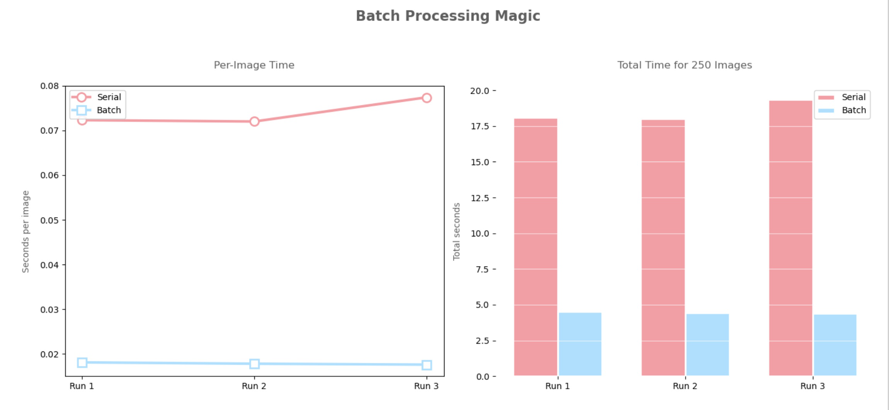

# Bird Species Classifier 🐦

A deep learning pipeline for automated bird species identification from trail camera images, with benchmarking of **serial vs. batch inference** on an HPC cluster.

Built with MobileNetV2 (pre-trained on ImageNet) and run on MSU's HPCC via SLURM.

---

## Overview

Wildlife monitoring with trail cameras generates large volumes of images that are time-consuming to label manually. This project explores using a pre-trained CNN to automate species identification and evaluates how much faster batch processing is compared to running images one at a time — a practical concern when scaling to thousands of images.

**Key results:**
- Processed **250 bird images** using MobileNetV2
- Batch inference: **4.43s total** (~0.018s/image)
- Serial inference: **18.94s total** (~0.072s/image)
- **~4x speedup** with batch processing on the same hardware
- Top-1 accuracy on 20 hand-labeled images: **15% exact**, **40% within genus/family** — consistent with MobileNet's ImageNet training (not fine-tuned on bird-specific species)

---

## Repository Structure

```
Bird-Classifier/
├── src/
│   ├── classify_serial.py        # Serial (one-at-a-time) MobileNetV2 inference
│   ├── classify_batch.py         # Batch MobileNetV2 inference
│   └── evaluate_accuracy.py      # Accuracy comparison against ground truth labels
├── hpc/
│   ├── mobilenet_batch.sb        # SLURM batch job script
│   └── mobilenet_cpu.sb          # SLURM CPU job script
├── results/
│   ├── batch_vs_serial.png       # Performance comparison chart
│   ├── bird_eval_results.csv     # Per-image prediction vs. ground truth
│   └── logs/                     # Raw SLURM output logs
├── data/
│   └── sample/                   # Sample test images (full dataset not included)
├── mobilenet_example/            # Standalone quickstart example
└── README.md
```

---

## Quickstart

### Local (testing)

```bash
pip install tensorflow opencv-python pillow numpy
python src/classify_serial.py
```

### HPC (SLURM)

```bash
# Batch inference
sbatch hpc/mobilenet_batch.sb

# Serial/CPU inference
sbatch hpc/mobilenet_cpu.sb
```

Place your images in a `data/` folder before running. Update the `folder_path` variable in the scripts if needed.

---

## Tech Stack

| Tool | Purpose |
|------|---------|
| Python 3 | Core language |
| TensorFlow / Keras | MobileNetV2 model loading and inference |
| OpenCV | Image preprocessing |
| NumPy / Pandas | Array manipulation and results analysis |
| SLURM | HPC job scheduling (MSU HPCC) |

---

## Results

### Serial vs. Batch Performance

| Method | Total Time | Avg per Image |
|--------|-----------|---------------|
| Serial | 18.94s | 0.0723s |
| Batch  | 4.43s  | 0.0178s |

Batch processing is approximately **4x faster** for this dataset size. The speedup is expected to grow further with larger image sets.



### Accuracy (20 hand-labeled images)

| Verdict | Count |
|---------|-------|
| Correct (exact match) | 3 / 20 (15%) |
| Challenging (genus/family match) | 5 / 20 (25%) |
| Wrong | 12 / 20 (60%) |

The relatively low top-1 accuracy reflects MobileNet's ImageNet training, which was not fine-tuned on the specific North American bird species in this dataset. Fine-tuning on a labeled bird dataset (e.g., CUB-200) would be a natural next step.

---

## Limitations & Future Work

- MobileNetV2 was used off-the-shelf (no fine-tuning) — fine-tuning on a bird-specific dataset like [CUB-200-2011](http://www.vision.caltech.edu/datasets/cub_200_2011/) would significantly improve accuracy
- Dataset is small (250 images, 20 labeled) — results should be interpreted accordingly
- GPU inference was not benchmarked in this project but would further reduce latency

---

## References

- [TensorFlow MobileNetV2 Documentation](https://www.tensorflow.org/api_docs/python/tf/keras/applications/MobileNetV2)
- [Keras Applications Overview](https://keras.io/api/applications/)
- [ImageNet Class Labels](https://www.image-net.org/)